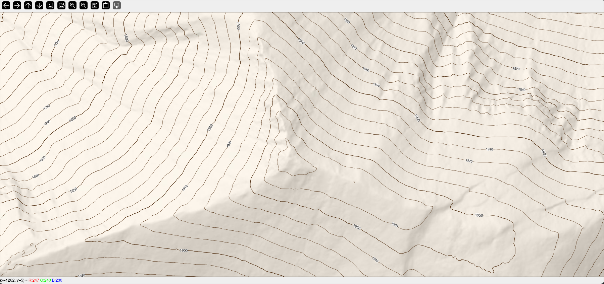
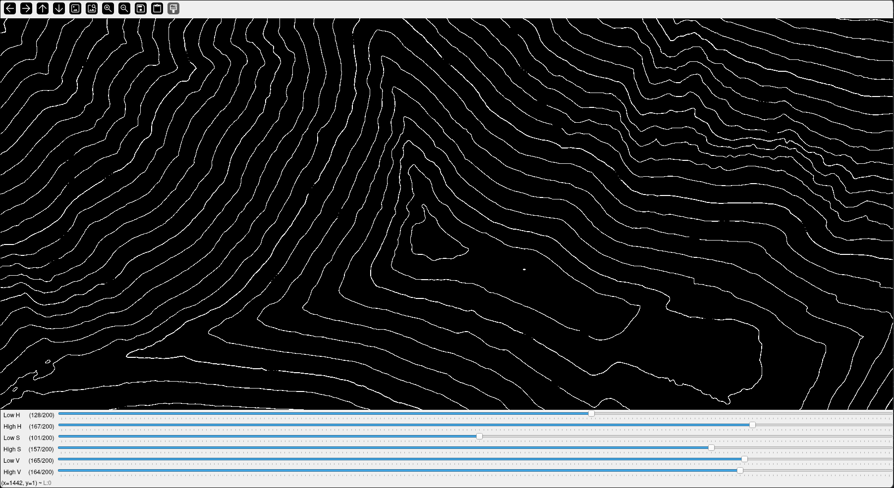
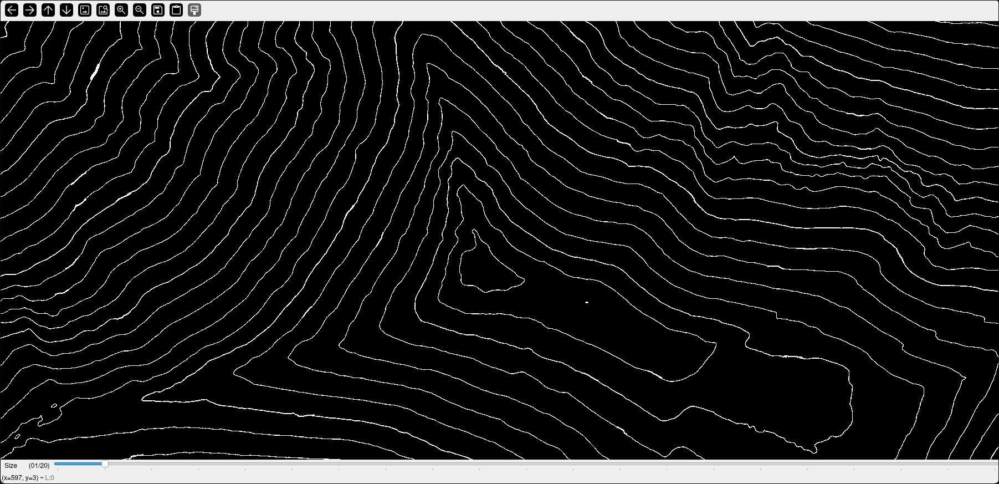
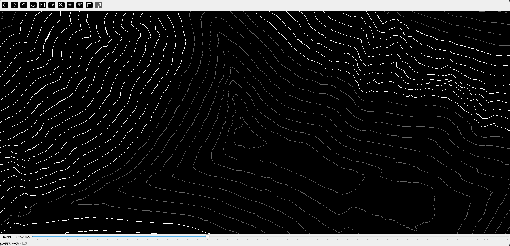

## Wybór koloru poziomic z mapy



## Wyodrębnianie poziomic z mapy



## Usuwanie ewentualnych błędów



## Dodawanie wysokości do poziomic



## Przykładowy plik .geojson

[Przykładowy plik wyjściowy](examples/contours.geojson)

## Przykładowy plik konfiguracyjny 

```
{
  "imageFormat": {
    "columns": 1,
    "rows": 1
  },
  "contour": {
    "scaleOfHeight": 1000,
    "minHeight": 1850,
    "maxHeight": 1992,
    "maxToleranceOfColor": 200,
    "freqOfPoints": 300
  }
}
```

Wykorzystywana biblioteka:
https://opencv.org/

Usuwanie koloru: 
https://pl.wikipedia.org/wiki/HSV_(grafika)
https://docs.opencv.org/3.4/da/d97/tutorial_threshold_inRange.html

Szukanie fragmentu zdjecia:
https://docs.opencv.org/4.x/de/da9/tutorial_template_matching.html#autotoc_md629

Tworzenie pliku GeoJson:
https://github.com/nlohmann/GeoJson

Usuwanie dziur miedzy poziomicami 
https://docs.opencv.org/4.x/d3/dbe/tutorial_opening_closing_hats.html
https://docs.opencv.org/4.x/df/d2d/group__ximgproc.html#ga37002c6ca80c978edb6ead5d6b39740c
